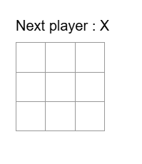

# 🎮 Tic-Tac-Toe Game

A simple and fun **Tic-Tac-Toe** (X-O) game built using **React**, **TypeScript**, and **Vite**. This mini-project demonstrates the fundamentals of component-based UI design, state management, and modern frontend tooling.

## 🚀 Project Demo

🔗 GitHub Repository: [Click Here](https://github.com/vaghasiya-dhruvesh/Project.git)

## 📷 Preview

  


## 🛠️ Tech Stack

- ⚛️ **React** – for building the UI
- 🟦 **TypeScript** – for type safety and better development experience
- ⚡ **Vite** – for lightning-fast development and build tools
- 🎨 **CSS** – for styling the components


## 🎯 Features

- ✅ Classic 3x3 Tic-Tac-Toe grid
- ✅ Two-player game (Player X and Player O)
- ✅ Detects win, draw, and restart option
- ✅ Clean and responsive UI
- ✅ Built with modular and reusable components

## 🧩 How to Run Locally

### 1. Clone the Repository

```bash
git clone https://github.com/vaghasiya-dhruvesh/Project.git
cd Project/funGame

2. Install Dependencies
bash
Copy
Edit
npm install
3. Run the App
bash
Copy
Edit
npm run dev
4. Build for Production
bash
Copy
Edit
npm run build
💡 Future Improvements
Add player vs computer mode

Add score tracking

Add animations and sound effects

Mobile-first responsive UI improvements